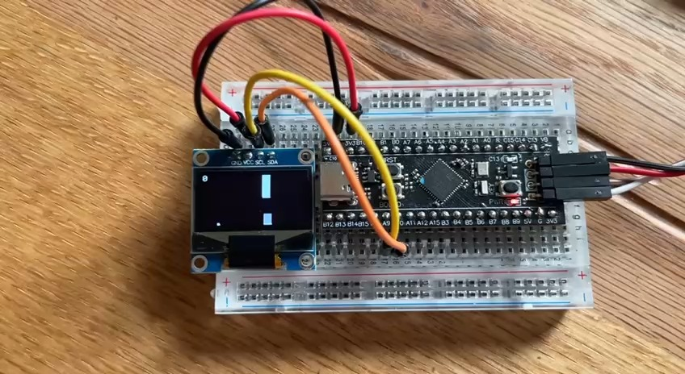

# Flappy Dot on STM32F401 + SSD1306 (I²C, bare-metal, 1-button)

A minimal, no-HAL, bare-metal game for **STM32F401CCU6** that draws to a **128×64 SSD1306 OLED** over **I²C** (bit-banged) and uses a single **push button** on **PA0** to “flap” a 3×3 dot through moving pipes.

- Display: SSD1306 128×64, I²C address **0x3C** (common)  
- I²C pins (bit-banged): **PA9 = SCL**, **PA10 = SDA**  
- Button: **PA0** with **internal pull-up** (button shorts to **GND** when pressed)  
- Clock: HSI **16 MHz** (default)  
- Timing: **SysTick** 1 ms tick for frame pacing (~30 fps target)

---

## Demo Video

---

## Hardware & Wiring

### Required
- STM32F401CCU6 board (a typical “Black Pill” style board)
- SSD1306 OLED (128×64) that supports I²C

### Connections

| Signal       | STM32F401 pin | OLED pin | Notes |
|--------------|----------------|----------|-------|
| **SCL**      | PA9            | SCL      | I²C clock (open-drain, needs pull-up) |
| **SDA**      | PA10           | SDA      | I²C data (open-drain, needs pull-up) |
| **3V3**      | 3V3            | VCC      | 3.3 V supply |
| **GND**      | GND            | GND      | Common ground |
| **Button**   | PA0 ↔ GND      | —        | Internal pull-up enabled in code |

---

## Why bit-bang I²C?

- It avoids using STM32 I²C peripherals so the example stays **single-file** and easy to port.
- Trade-off: It’s **slower** than hardware I²C. You can increase FPS by reducing the software delay or (best) switching to the hardware I²C peripheral at 400 kHz “Fast Mode”.

---

## What is I²C (and how this code uses it)?

**I²C** is a 2-wire, open-drain bus:

- **SCL** (clock) and **SDA** (data) are both **open-drain** outputs:
  - Devices can **pull the line low**, but never drive it high.
  - Pull-up resistors bring the lines high when nobody pulls low.
- **Bus levels**:
  - **Low (0)**: actively pulled down by a device
  - **High (1)**: released; the pull-up resistor lifts the line

**Transfers**:

1. **START**: SDA falls while SCL is high  
2. **Address + R/W** (7-bit addr + 1 R/W bit)  
3. **ACK/NACK**: receiver pulls SDA low to **ACK** the byte  
4. **Data bytes** (each byte followed by ACK from receiver)  
5. **STOP**: SDA rises while SCL is high

**In this project**:
- We **bit-bang** SCL/SDA using **PA9/PA10** in **open-drain** output mode.
- `i2c_start()`: makes a START condition
- `i2c_write_byte()`: shifts out 8 bits MSB-first and reads the **ACK** bit
- `i2c_stop()`: makes a STOP condition
- SSD1306 requires a **control byte** before commands/data:
  - `0x00` = commands
  - `0x40` = data stream (display RAM)

**SSD1306 addressing & pages**:
- The 128×64 buffer is organized as **8 pages** (each page = 8 vertical pixels × 128 columns).
- We keep a **1024-byte framebuffer** in RAM and push it page-by-page.
- This is simple but means each frame writes 1024 bytes.

---

## What is SysTick and why we use it?

**SysTick** is a **24-bit core timer** inside the ARM Cortex-M. You load a reload value; it counts down and **interrupts periodically**:

- We set reload to **F_CPU/1000 - 1** so SysTick fires **every 1 ms**.
- Interrupt handler increments `ms_ticks`.
- `delay_ms(n)` spins until `ms_ticks` advances by `n`.
- The main loop runs at a target period (≈33 ms → ~30 FPS), paced by `ms_ticks`.

**Why use it?**
- Provides a stable **timebase** independent of code execution speed.
- Keeps **physics & rendering** smooth and consistent.

---

## STM32 register elements used (hardware side, plain English)

### RCC (reset & clock)
- **RCC_AHB1ENR**: we set bit **0** to enable the **GPIOA** clock.
  - Without clocks, peripherals don’t work (their registers won’t respond).

### GPIOA
- **MODER**: *2 bits per pin*
  - `00` input, `01` output, `10` alternate function, `11` analog
- **OTYPER**: output type
  - `0` push-pull, `1` open-drain
- **OSPEEDR**: output slew rate (we set **high** so edges are sharp)
- **PUPDR**: internal pull-ups/pull-downs
  - Button: PA0 uses **pull-up** (01) so it reads `1` unpressed and `0` when pressed to GND
- **IDR**: input data register (we read PA0 here)
- **BSRR**: bit set/reset register
  - Lower 16 bits “set high”, upper 16 bits “set low”
  - With **open-drain** pins: “set” means *release* the line; “reset” means *drive low*

### SysTick
- **SYST_RVR** (reload value): `F_CPU/1000 - 1` for 1 ms
- **SYST_CVR** (current value): any write clears it
- **SYST_CSR** (control/status):
  - `CLKSOURCE=1` (CPU clock), `TICKINT=1` (IRQ), `ENABLE=1` (start)

---

## License
MIT License